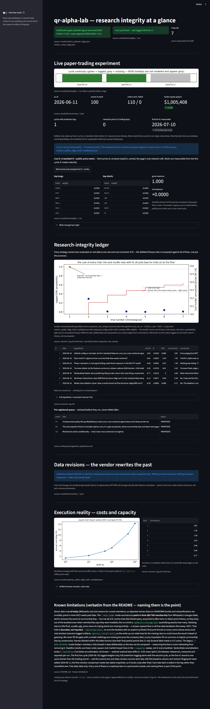

# qr-alpha-lab

An honest cross-sectional alpha research pipeline: data → features → walk-forward ML → cost-aware backtest → deflated evaluation.

Most retail backtests are statistical fiction. The published evidence says so: anomaly returns fall 26% out-of-sample and 58% post-publication (McLean & Pontiff, JF 2016), most published factors fail honest multiple-testing corrections (Harvey–Liu–Zhu, RFS 2016), and the maximum in-sample Sharpe across enough trials looks brilliant even on pure noise (Bailey & López de Prado, 2014). This project is built around *not fooling myself*, which is the actual job of a quantitative researcher.

## See the falsification gate catch a leak (one command)

The differentiator, made visible: the gate recovers a planted signal, rejects pure noise, and goes **red the instant a one-line look-ahead leak enters the pipeline**.

```
$ python scripts/leak_demo.py

[1] PLANTED signal                 IC=+0.0629  DSR=0.9919   gate(DSR>=0.95): PASS -- signal recovered
[2] PURE NOISE                     IC=-0.0199  DSR=0.0004   gate(DSR<=0.5):  PASS -- nothing found
[3] NOISE + 1-line lookahead leak  IC=+1.0000  DSR=1.0000   gate(DSR<=0.5):  FAIL -- noise "found alpha"
    (injected: panel['leak_fwd_return'] = panel['label'])
```

That exact gate runs in CI on every push — so a future-peeking feature anywhere in the pipeline turns the build red, not just my confidence. Full transcript: [`results/leak_demo_transcript.txt`](results/leak_demo_transcript.txt). (For an inline GIF, `asciinema rec` the command above.)

## What makes this pipeline defensible

**Planted-signal / pure-noise validation.** Before trusting any result on real data, the pipeline must pass two falsification tests:

```
python scripts/run_pipeline.py --data planted --fail-if-dsr-below 0.95  # known weak signal → must be recovered
python scripts/run_pipeline.py --data noise --n-trials 20 --fail-if-dsr-above 0.5  # no signal → must be rejected
```

Both checks run in CI on every push (`.github/workflows/ci.yml`) and fail the build on violation — leakage introduced by any future commit breaks CI, not just my confidence.

Current results: planted → out-of-sample rank IC 0.063 (Newey–West t = 2.0), net Sharpe 0.86, **DSR 0.99 → recovered**. Noise → IC −0.02, **DSR 0.0004 → correctly rejected**. A pipeline that "finds alpha" in noise has leakage; one that can't find a planted signal has bugs. This pipeline passes both.

**Walk-forward validation with embargo.** Expanding-window splits only; a 21-day embargo between train and test windows prevents overlapping forward-return labels from leaking future information into training (purged CV, López de Prado ch. 7). Standard k-fold on financial panels is silently invalid — this is the single most common fatal flaw in student projects.

**Costs are first-class.** Transaction costs are charged on every unit of turnover (default 10 bps/side), and annualized turnover is a headline metric, because almost no high-turnover published anomaly survives costs (Novy-Marx & Velikov, RFS 2016).

**Deflated Sharpe Ratio with an honest trial count.** The `--n-trials` flag forces you to declare how many strategy variants you have tried in total; the DSR then benchmarks your Sharpe against the expected maximum of that many noise draws. Tracking N is the discipline; the formula is the easy part.

**No lookahead by construction, verified by test.** Weights formed at date *t* earn returns only from *t+1*. The test suite includes a same-day-return exploit test that a buggy backtester fails loudly, plus a counter-test proving genuine foresight *would* profit (a check of the check).

**Baselines first.** Every run reports the model against (a) a one-line 12-1 momentum decile long-short and (b) an equal-weight 1/N portfolio, on the same out-of-sample dates, through the same cost-aware backtester. On the planted panel the momentum baseline (net SR 1.19) *beats* the ridge model (net SR 0.86) — the planted signal is literally momentum, and the model dilutes it across five features. If ML can't beat the baseline on real data either, that gets reported, not hidden. (The baselines also caught a real bug: an "equal-weight SR of 3.3" was impossible on its face and exposed pad-filled phantom returns for delisted names.)

**Survivorship bias, measured on this very pipeline.** The same ridge config earns net Sharpe **0.82** (IC 0.033) on a static universe of today's members — and net Sharpe **−0.01** (IC 0.005, Newey–West t = 0.5) on the point-in-time S&P 500. The entire "edge" was hindsight in the universe selection. McLean & Pontiff in miniature, reproduced in-house, and the single best exhibit this project owns.

**The honest bottom line on the equity ablation (trials #2–#7).** Across horizons (21/63d), labels (raw/beta-residualized), models (ridge/GBR/shallow-NN), and neutralization, no configuration of five price-only features earns a defensible net edge on the bias-corrected universe (best DSR 0.04). The pipeline provably recovers planted signals and rejects noise — the conclusion is about the signals, not the plumbing, and it matches the published record for heavily-arbitraged large caps. A negative result you can trust is the deliverable; the trials that produced near-misses (|t_NW| ≈ 1.9) are documented in `research_log.md` along with why we refuse to trade the sign-flip.

**The full arc: thirteen logged trials, three asset classes, zero graduations.** After the equity nulls, the same machine was pointed at markets where a premium has a structural reason to exist. Trial #8 (crypto-perp funding carry) is the project's first genuine non-null — net Sharpe 0.87, IC t_NW −3.54, controls clean — that *still* fails the pre-registered Deflated Sharpe bar (0.865 < 0.95), is crash-skewed (−1.87), and has decayed from Sharpe 2.3 to ~0.4 as the trade institutionalized; the criteria were **not** relaxed. Trial #9 showed the famous S&P-deletion rebound is just matched small-loser mean reversion (Greenwood–Sammon, reproduced in-house). Trial #10 ran the carry machine into the liquid tail and found a signal just as significant (t_NW −3.62) that loses money net — the cleanest IC-≠-P&L exhibit in the project. Trial #11 (closed-end-fund discount reversion) cleared *every* pre-registered bar at once — net Sharpe 1.11, DSR 0.999 — and was then overturned by its own entry-lag diagnostic (1.11 → 0.10 at a one-week lag): a bid-ask-bounce microstructure artifact, not reversion. Trial #12 (fundamental quality, unblocked after a free SEC name→CIK crosswalk plus Tiingo delisting-inclusive prices solved the survivorship gate from trial #1) earned a raw net Sharpe of +0.58 (t_NW +2.30) that collapses to −0.18 in the HML-neutral arm where graduation is judged — the "quality" edge was the value factor in disguise, exactly the failure mode the two-arm design was pre-registered to catch. Trial #13 (broad-basket insider cluster-buying, the powered redesign after the top-decile book failed its pre-spend power gate) was a clean null: net Sharpe −0.13, opportunistic clusters no better than routine ones. The discipline killing its own best-looking numbers is the point. **The product is the research process, not the alpha.** Full write-up: [`writeup/research_note.md`](writeup/research_note.md) (PDF: [`writeup/Galvez_2026_falsification_first.pdf`](writeup/Galvez_2026_falsification_first.pdf)); every number traces to a row in `research_log.md`.

**Capacity is a first-class question.** `--capacity` sweeps AUM through a square-root impact model (trailing dollar-ADV, point-in-time, k = 1) and reports where net Sharpe dies — because "does it scale?" is the question that separates a backtest from a business.

**Neutrality is measured, not asserted.** `--neutralize sector|beta|both` demeans predictions within GICS sector and projects rebalance weights to zero ex-ante market beta (rolling 252-day betas, past data only). Every run — neutralized or not — emits a risk report (realized rolling beta, market correlation, sector net exposures), because a "market-neutral" label without measurement is marketing. On the planted panel, neutralization cuts p95 |rolling beta| from 0.32 to 0.03 while the planted (idiosyncratic) signal survives intact — which is exactly the pair of facts that proves the projection removes factor exposure and not signal.

**Label and cadence research, counted.** `--label residual` predicts beta-residualized forward returns (past-only rolling betas — the only return a dollar-neutral book can harvest); `--horizon` and `--rebalance` trade signal speed against turnover. Every per-window univariate feature IC ships as a CSV (`feature_ics_*.csv`) with sign-consistency printed per run, because a feature whose IC flips sign across walk-forward windows is an overfitting tell regardless of its pooled value. Each configuration evaluated on real data increments the trial count in `research_log.md` — no exceptions.

**Vectorized but pinned.** The IC computation, weight construction, and walk-forward slicing are vectorized (~4.4× core speedup), and each optimized path is pinned by a test against a naive per-date reference implementation, so a future "optimization" that drifts the numbers fails the suite.

## Layout

```
src/quantlab/
  data.py        # yfinance loader with parquet cache; chunked downloads
  universe.py    # point-in-time S&P 500 membership from Wikipedia changes table
  synthetic.py   # planted-signal and pure-noise panels for falsification tests
  features.py    # cross-sectionally z-scored: 12-1 momentum, 6-1, reversal, vol, 52w-high;
                 # member-masked z-scores; optional beta-residualized labels
  validation.py  # expanding walk-forward splitter with embargo
  models.py      # Ridge baseline + gradient boosting; per-date rank IC;
                 # ridge_cv = nested per-roll alpha tuning (train window only)
  baselines.py   # 12-1 momentum decile L/S + equal-weight 1/N benchmarks
  risk.py        # sector demean, beta-neutral weight projection, risk report
  backtest.py    # dollar-neutral decile long-short, linear costs, turnover
  metrics.py     # Sharpe, max DD, PSR, Deflated Sharpe, Newey-West t-stats
  impact.py      # square-root market impact, dollar-ADV, capacity curves
  env.py         # minimal .env loader (Alpaca keys, Phase 6)
  live.py        # daily paper-trading: complete-label training, order deltas,
                 # paper-only Alpaca client; predictions logged before orders
  monitor.py     # Phase 6 monitoring: cycle continuity, live IC vs backtest IC,
                 # mark-to-market of logged books (read-only by design)
scripts/run_pipeline.py   # end-to-end CLI (incl. CI falsification-gate flags)
scripts/live_report.py    # one-page live-monitoring report from results/live/
tests/                    # 386 tests across 54 files: leakage, costs, DSR
                          # monotonicity, lookahead, baselines, vectorized-vs-naive
                          # equivalence, nested-tuning leak checks, live-order &
                          # monitor known answers, regime causality, carry/CEF/
                          # event/fundamentals/insider harnesses, PBO/CSCV,
                          # registry refusal paths
research_log.md           # every trial ever run; owns the honest --n-trials count
.github/workflows/ci.yml  # unit tests + falsification gate on every push
```

## Quick start

```
pip install -r requirements.txt
python -m pytest tests/ -q                              # 386 tests
python scripts/run_pipeline.py --data planted           # sanity check 1
python scripts/run_pipeline.py --data noise --n-trials 20   # sanity check 2
# Real-data runs are registration-gated (law #3, mechanized): they require
# either --hypothesis Hn (a PROPOSED entry in writeup/preregistered_hypotheses.md
# -- spends a trial) or --reproduce "reason" (re-running logged work):
python scripts/run_pipeline.py --data sp500 --n-trials 7 --reproduce "trial #2 artifacts"
python scripts/run_pipeline.py --data yfinance --model gbr --n-trials 7 --reproduce "trial comparison"
```

Outputs land in `results/`: metrics JSON + equity-curve PNG per run.

## Live paper trading (Phase 6)

A daily GitHub Actions job (`.github/workflows/live.yml`, 22:30 UTC weekdays) rebuilds the point-in-time universe, trains on **fully-labeled history only** (rows newer than `today − horizon` have incomplete labels and are excluded — live trading gets the same leakage discipline as the backtest), logs the day's full prediction cross-section to `results/live/predictions_*.csv` *before* any order exists (`pred_raw`, the object the backtest's IC is computed on; `pred_sector_neutral`, the one that drives the book; `baseline_mom_12_1`, the control arm — see below), then submits integer-share, per-name-capped orders to an Alpaca **paper** account (the client refuses any non-paper endpoint). The prediction log is committed back to the repo — an immutable, timestamped record that after each 21-day horizon elapses yields **live IC vs backtest IC**, the ultimate out-of-sample test. Local alternative: `python scripts/live_trade.py [--dry-run]`.

The live experiment has a **control arm**: every cycle shadow-logs the 12-1 momentum baseline's values on the same names (no orders are ever sent for it). If the model's live IC comes in below its backtest IC, the baseline's own live-vs-backtest gap separates "the model decayed" from "the period was hostile to everything" — a live test without a control cannot tell those apart.

Each cycle also writes a **data-revision fingerprint** (`results/live/revisions_*.json`): today's freshly downloaded price history diffed against the previous cycle's snapshot of the *same past*. Free-data "history" is not point-in-time — the vendor retroactively re-adjusts whole series when a dividend lands — so the monitor counts price-cell revisions (mostly benign whole-history re-scalings) separately from **return-cell revisions**, the kind that silently alter features and labels. `python scripts/data_revisions_report.py` aggregates the series across snapshots; measuring the drift beats assuming it away.

Monitoring: `python scripts/live_report.py` renders a one-page report from the logs — cycle continuity (silently missed crons get caught in days, not months), per-cycle live IC vs the backtest's mean IC once cycles mature (model and control arm), the latest data-revision summary, and a public-price mark-to-market of the logged books as a cross-check on the broker's equity curve. Read-only by construction; it cannot contaminate the strategy.

One-time setup: repo → Settings → Secrets and variables → Actions → add `ALPACA_API_KEY_ID` and `ALPACA_API_SECRET_KEY` (paper keys). The workflow skips gracefully until they exist.

## Dashboard

One read-only Streamlit page over `results/` and the research log — falsification-gate status, the live experiment (cycle continuity, maturity countdown, live-vs-backtest IC with the momentum control arm), the trial ledger with the DSR-vs-N luck hurdle, data-revision tracking, and the capacity curve. It can display, and never change, the research record: `pip install -r requirements-dashboard.txt && streamlit run dashboard/app.py` (dashboard deps are deliberately separate so the nightly trading cycle can never be broken by them).

Containerized deployment is also supported from the repo root:

- Build: `docker build -t qr-alpha-lab-dashboard .`
- Run: `docker run --rm -p 8501:8501 -v "$PWD/results:/app/results" -v "$PWD/research_log.md:/app/research_log.md" qr-alpha-lab-dashboard`
- Or with compose: `docker compose up --build`

For hosted platforms that support `Procfile`-based Python apps, the included `Procfile` starts the dashboard on the platform-provided `$PORT`.



## Known limitations (deliberate honesty)

Sector data is **as-of-today** (Wikipedia only lists sectors for current members), so departed names share an UNKNOWN bucket and reclassifications are invisible; point-in-time GICS needs paid data. The `--data sp500` mode reconstructs **point-in-time S&P 500 membership** from Wikipedia's changes table, which removes the worst of survivorship bias — but not all of it: names that died (bankruptcy, acquisition) often have no Yahoo price history, so they drop out of the backtest even when membership says they were tradable; the run emits a `sp500_pit_coverage.json` quantifying exactly how many. Delisting returns (the final, usually ugly, price move of a dying stock) are missing entirely — a known upward bias in all free-data backtests (Shumway 1997). That hole is **bounded, not imputed**: `--delisting-return` re-runs the backtest with an explicit synthetic final print forced on every name whose series ends mid-window (scenario-tagged artifacts, `metrics_*_dlret*.json`), so the write-up can state how far the missing returns could move the result instead of guessing. We never fill the gaps with a model: delistings are missing *because* the company died, so any imputation fit on survivors re-injects survivorship bias by construction. Names delisted within the label horizon lose their final partial period (the 21-day forward label needs a t+21 price). The legacy `--data yfinance` mode (today's members, fully biased) is kept deliberately so the two can be compared — measuring the bias is more interesting than removing it. Headline results use linear costs; square-root market impact lives in the `--capacity` sweep, not in every backtest. Sector/beta neutralization exists (`--neutralize`) but betas are estimated, not known — realized residual beta drifts to ~0.05 mean (p95 0.23) between rebalances, measured and reported per run. The first live cycle (2026-06-10) logged weights only; full prediction logging starts with the second cycle, so the live-IC record is one cycle shorter than the trading record — and the control-arm and data-revision records start later still (the baseline column and revision fingerprint were added 2026-06-11; the first revision comparison needs two dated snapshots, so it lands a day after that). Each late start is dated in the log rather than smoothed over. Free daily data only. Every one of these is a roadmap item or a permanent caveat, and naming them is part of the point.

## References

Jegadeesh & Titman (1993); McLean & Pontiff (2016); Harvey, Liu & Zhu (2016); Bailey & López de Prado (2014), "The Deflated Sharpe Ratio"; López de Prado (2018), *Advances in Financial Machine Learning*; Novy-Marx & Velikov (2016); Gu, Kelly & Xiu (2020).
